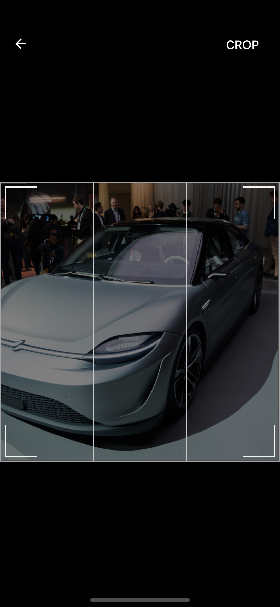

<h1 align="center">React Native Expo Image Cropper</h1>
<p align="center">iOS and Android</p>
<p align="center">
   <br/>
   <br/>
   <br/>
   <br/>
   <a href="https://github.com/cloudtenlabs/react-native-expo-image-cropper">
   <a href="https://github.com/cloudtenlabs/react-native-expo-image-cropper">
   <a href="https://github.com/cloudtenlabs/react-native-expo-image-cropper">
   <p align="center">
    
   
   
   (https://youtu.be/Zi46ASsb6Eg)
      
  <a href="https://exp.host/@wang90925/react-native-expo-image-cropper">Open on your device!</a>
</p>
</a>
</p>

### Install Dependences
- yarn add react-native-expo-image-cropper

## Example

```javascript
import React from 'react'
import { Dimensions, TouchableOpacity, ImageBackground } from 'react-native'
import { ExpoImageManipulator } from 'react-native-expo-image-cropper'

export default class App extends React.Component {
  state = {
      showModal: false,
      uri: 'https://media.sproutsocial.com/uploads/2017/02/10x-featured-social-media-image-size.png',
  }
  onToggleModal = () => {
      const { showModal } = this.state
      this.setState({ showModal: !showModal })
  }
  render() {
      const { uri, showModal } = this.state
      const { width, height } = Dimensions.get('window')
      return (
          <ImageBackground
              resizeMode="contain"
              style={{
                  justifyContent: 'center', padding: 20, alignItems: 'center', height, width, backgroundColor: 'black',
              }}
              source={{ uri }}
          >
                <TouchableOpacity title="Open Image Editor" onPress={() => this.setState({ showModal: true })} />
                <ExpoImageManipulator
                    photo={{ uri }}
                    isVisible={showModal}
                    onPictureChoosed={(data) => {
                        this.setState({ uri: data.uri })
                    }}
                    onToggleModal={() => this.setState({ showModal: !showModal })}
                    saveOptions={{
                        compress: 1,
                        format: 'png',
                        base64: true,
                    }}
                />
          </ImageBackground>
      )
  }
}
```

## Run the example!
- Clone this repository
- cd example/
- run yarn or npm install
- enjoy!


## Requirements
* Use it into Expo app (from expo client, Standalone app or ExpoKit app).
* Because we need to have access to `Expo.ImageManipulator`
* Only Expo SDK 33 or Higher

## Features
* Crop and rotate image with `Expo.ImageManipulator`

## Kown Issues

## If you have some problem open a issue

## TO DO
